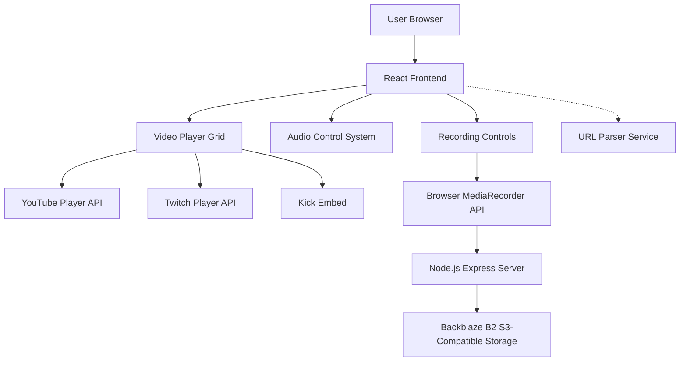
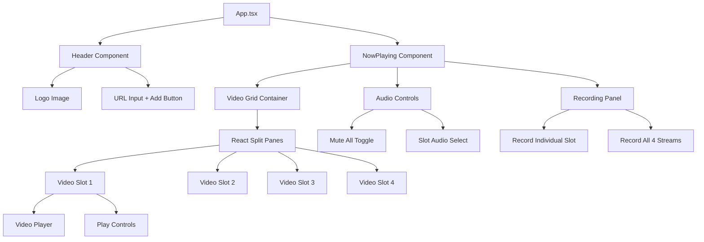
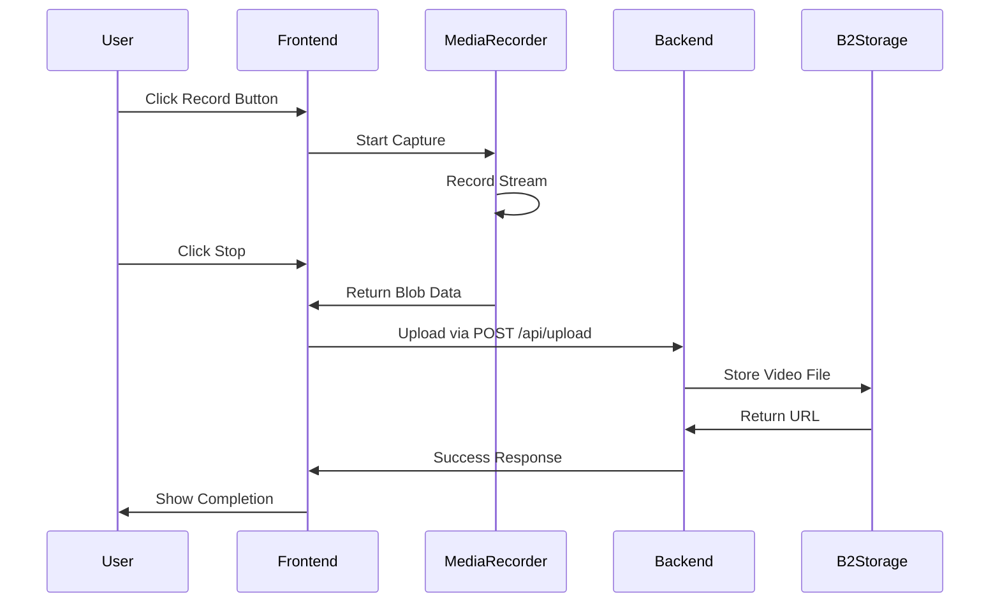

# TWill - The Content Plug
## Architectural Plan & Technical Specification

### Project Overview
TWill is a multi-stream video player platform that allows users to watch and record up to 4 simultaneous video streams from YouTube, Twitch, and Kick. The interface is inspired by Netflix's clean, dark aesthetic with a focus on usability and performance.

---

## System Architecture



---

## Technology Stack

### Frontend
- **React 18** with TypeScript
- **React Split Pane** for resizable video slots
- **CSS Modules** or **Styled Components** for Netflix-themed styling
- **MediaRecorder API** for browser-based recording
- **React Context API** for state management

### Backend
- **Node.js** with Express
- **Backblaze B2 SDK** with S3-compatible API
- **Multer** for handling file uploads
- **CORS** enabled for frontend communication

### Video Player APIs
- **YouTube IFrame Player API**
- **Twitch Embed SDK**
- **Kick** - iframe embedding or player API if available

### Storage
- **Backblaze B2** S3-compatible bucket
  - Bucket name: ytvideostwill
  - Uses S3-compatible API endpoints

---

## Component Structure



---

## Key Features Implementation

### 1. URL Input & Platform Detection

**URL Parser Service:**
```typescript
interface ParsedVideo {
  platform: 'youtube' | 'twitch' | 'kick';
  videoId: string;
  isLive: boolean;
}

// Examples:
// YouTube: youtube.com/watch?v=VIDEO_ID
// Twitch: twitch.tv/CHANNEL_NAME
// Kick: kick.com/CHANNEL_NAME
```

### 2. 4-Slot Video Grid

**Layout Structure:**
- Full browser width
- 2x2 grid layout
- Resizable with vertical & horizontal dividers
- Each slot can independently host a video
- Empty slots show placeholder state

**Split Pane Configuration:**
- Horizontal divider between top and bottom rows
- Vertical divider between left and right columns
- Persist resize preferences in localStorage

### 3. Audio Control System

**Requirements:**
- Only ONE slot can have audio active at a time
- "Mute All" button to silence all streams
- Click individual slot to activate its audio
- Active audio slot has visual highlight
- All other slots muted when one is selected

**State Management:**
```typescript
interface AudioState {
  activeSlot: number | null; // 0-3 or null for mute all
  muteAll: boolean;
}
```

### 4. Video Recording Feature

**Recording Options:**

A. **Individual Slot Recording**
- Select specific slot to record
- Captures that slot's video stream
- Includes audio from that slot

B. **Combined Recording**
- Records entire viewport with all 4 streams
- Captures the complete 2x2 grid layout
- Includes audio from currently active slot

**Recording Flow:**


### 5. Netflix-Inspired UI Design

**Color Scheme:**
- Background: `#141414` (Netflix dark)
- Primary accent: `#E50914` (Netflix red)
- Secondary background: `#221F1F`
- Text primary: `#FFFFFF`
- Text secondary: `#B3B3B3`
- Border/divider: `#333333`

**Typography:**
- Font: Netflix Sans or fallback to system sans-serif
- Header logo: Prominent positioning
- Clean, minimal interface

**Visual Elements:**
- Rounded corners on cards/buttons
- Subtle hover effects
- Smooth transitions
- Active slot highlight with red border glow

---

## Technical Considerations

### Video Player Integration

**YouTube:**
- Use YouTube IFrame Player API
- Control playback, volume, quality
- Handle player state events

**Twitch:**
- Use Twitch Embed SDK
- Support both VODs and live streams
- Control volume and mute

**Kick:**
- Research current embedding capabilities
- May use iframe with embed URL
- Fallback to direct link if no embed available

### Recording Challenges

**Browser MediaRecorder API:**
- Supported codecs vary by browser
- Use `video/webm` for broad compatibility
- Capture via `captureStream()` on video elements
- For combined recording, capture entire grid container

**Performance:**
- 4 simultaneous streams = high resource usage
- Consider video quality settings
- Monitor memory usage
- Implement cleanup on component unmount

**Upload Strategy:**
- Chunk large video files
- Show upload progress
- Handle failed uploads with retry logic
- Generate unique filenames with timestamps

### Backblaze B2 Integration

**S3-Compatible API:**
- Use AWS SDK with custom endpoint
- Endpoint format: `s3.region.backblazeb2.com`
- Bucket operations via S3 API calls

**Security:**
- Store credentials in `.env` file
- Never expose keys in frontend code
- Backend handles all S3 operations
- Use presigned URLs for client uploads (optional optimization)

### State Management

**React Context for:**
- Video slot states
- Audio control state
- Recording state
- URL input state

**Local State for:**
- Player controls
- UI interactions
- Form inputs

---

## File Structure

```
twill/
├── frontend/
│   ├── src/
│   │   ├── components/
│   │   │   ├── Header/
│   │   │   │   ├── Header.tsx
│   │   │   │   ├── Header.module.css
│   │   │   │   └── URLInput.tsx
│   │   │   ├── NowPlaying/
│   │   │   │   ├── NowPlaying.tsx
│   │   │   │   ├── VideoGrid.tsx
│   │   │   │   ├── VideoSlot.tsx
│   │   │   │   ├── AudioControls.tsx
│   │   │   │   └── RecordingPanel.tsx
│   │   │   └── Players/
│   │   │       ├── YouTubePlayer.tsx
│   │   │       ├── TwitchPlayer.tsx
│   │   │       └── KickPlayer.tsx
│   │   ├── contexts/
│   │   │   ├── VideoContext.tsx
│   │   │   └── AudioContext.tsx
│   │   ├── services/
│   │   │   ├── urlParser.ts
│   │   │   └── recordingService.ts
│   │   ├── hooks/
│   │   │   └── useMediaRecorder.ts
│   │   ├── styles/
│   │   │   └── theme.css
│   │   ├── assets/
│   │   │   └── twill.jpg
│   │   ├── App.tsx
│   │   └── index.tsx
│   ├── public/
│   └── package.json
├── backend/
│   ├── src/
│   │   ├── routes/
│   │   │   └── upload.ts
│   │   ├── services/
│   │   │   └── s3Service.ts
│   │   ├── middleware/
│   │   │   └── multer.ts
│   │   └── server.ts
│   ├── .env
│   └── package.json
├── plans/
│   └── twill-architecture.md
└── twill.jpg
```

---

## API Endpoints

### Backend REST API

**POST /api/upload**
- Upload recorded video to B2 storage
- Body: multipart/form-data with video file
- Returns: { success: boolean, url: string, filename: string }

**GET /api/health**
- Health check endpoint
- Returns: { status: 'ok', timestamp: string }

---

## Environment Variables

**Frontend (.env):**
```
REACT_APP_API_URL=http://localhost:3001
```

**Backend (.env):**
```
PORT=3001
B2_KEY_ID=005b47fe07ba9f70000000002
B2_APPLICATION_KEY=K005WQkI0Pfr2U3SpIYKZrfNmmIFAwY
B2_BUCKET_NAME=ytvideostwill
B2_ENDPOINT=s3.us-west-004.backblazeb2.com
```

---

## Development Workflow

1. Initialize React app with TypeScript
2. Set up Express backend with S3 integration
3. Build UI components from header down
4. Integrate video players one platform at a time
5. Implement audio control system
6. Add resizable grid functionality
7. Implement recording feature
8. Test and refine user experience

---

## Testing Strategy

### Manual Testing Checklist:
- [ ] URL parsing for all 3 platforms
- [ ] Video playback in each slot
- [ ] Audio switching between slots
- [ ] Mute all functionality
- [ ] Resize panes horizontally and vertically
- [ ] Record individual slots
- [ ] Record combined view
- [ ] Upload to B2 storage
- [ ] Cross-browser testing (Chrome, Firefox, Safari, Edge)
- [ ] Responsive design on different screen sizes
- [ ] Performance with 4 simultaneous streams

---

## Potential Challenges & Solutions

**Challenge 1: CORS Issues with Kick Embeds**
- Solution: Check Kick's embedding documentation, use iframe with proper sandbox attributes

**Challenge 2: Audio Conflicts Between Players**
- Solution: Implement central audio manager that mutes/unmutes players programmatically

**Challenge 3: Large Video File Uploads**
- Solution: Implement chunked uploads, show progress, handle network interruptions

**Challenge 4: Browser Compatibility for MediaRecorder**
- Solution: Feature detection, fallback messaging for unsupported browsers

**Challenge 5: Performance with 4 Streams**
- Solution: Allow quality selection per stream, lazy load players, optimize re-renders

---

## Future Enhancements

- Save layouts/presets
- Queue system for adding videos
- Playlist support
- Chat integration for live streams
- Picture-in-picture mode
- Keyboard shortcuts
- Dark/light theme toggle
- Stream health monitoring
- Automatic recording of live streams
- Cloud storage of viewing history
